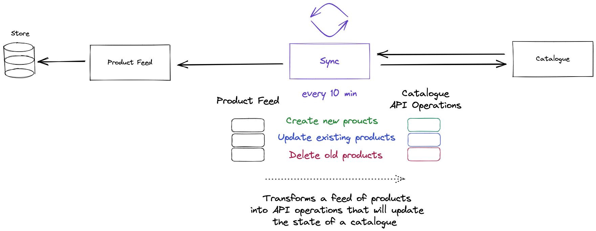

# Getting Started

Install the version of Node required by the project

```bash
$ nvm install & nvm use
```

Install project dependencies

```bash
$ npm i
```

Start the project:

```bash
$ npm run test:main:watch
```

# Timing

- 10 - 15 min introduction and project setup
- 1 hour exercise
- 10 min review / questions

# Background

You have a job working for a company that sells Sporting Memorabilia and the marketing manager wants to begin advertising your products on Snapchat in the lead up to Black Friday.

Your company have a simple Product feed which will return a list of active products and some information about them.

Snapchat provide an API which allows you to manage Catalogues (a group of products) which you can then advertise to the users of their app.

You have been tasked with building a component to sync your company's products to a SnapChat Catalogue.



# Format

- There are 6 exercises, each building upon the last.
- To verify your solution to an exercise you can run `npm run test:main` (add a `.only` to each
  test as you progress in `main.spec.ts`)
- `index.ts` must export a single function `syncProductFeed` - **this should return
  a list of products**. How you structure the rest of your codebase is up
  to you.
- You do not need to worry about how the **Product Syncer** is scheduled. This will be emulated for you.
- API clients for the Product Feed and Snapchat Catalogue have been provided for you and are passed as arguments to the `syncProductFeed` function.

## Exercise 1

You think a good place to start would be by familiarising yourself with the Product
Feed API and Snapchat API.

For this prototype, the Product Syncer should create every product returned from the
Product Feed in a Snapchat Catalogue.

**You can make the following assumptions:**

- Every product returned from the Product Feed should be created in a Snapchat Catalogue.
- There is only one of each product. Everything sold is unique.
- As every product is unique, you don't have to worry if they already exist in a
  Snapchat Catalogue.

## Exercise 2

Now that you have a feel for the various APIs you are working with, you think a good next step
would be to ensure the Product Syncer only creates **new** products in a Snapchat Catalogue.

**You can make the following assumptions:**

- A product created in a Snapchat Catalogue stays there forever.
- The product feed only returns a list of in-stock products, and nothing goes out of stock.
- There is (still) only ever one of each product. Everything sold is unique.

## Exercise 3

The Marketing team have told us that SnapChat aren't showing our products nearly as often as we'd like! Apparently this is because all of our products, including the fast selling "Match ball signed by Lebron James", only have a single item in-stock.

You've been asked if we can accurately reflect the real number of products we have in-stock in the Product Catalogue.

**You can make the following assumptions:**

- The number of times a product appears in the Product Feed is equal to the amount of that product in stock.

## Exercise 4

Apparently the "Match ball signed by Lebron James" is very underpriced and the Sales team have asked the price be updated in the SnapChat Catalogue.

You realise that the **Product Syncer** doesn't update existing products and decide to get to work.

**You can make the following assumptions:**

- The Snapchat API doesn't mind if you update products, even if they haven't changed.

## Exercise 5

Having now fixed every item being the very last of its kind your products are flying off the shelves. Surprisingly, the "Match ball signed by Lebron James" is proving particularly popular. So much so that we've received several customer complaints that the advertised product is out of stock.

In dawns on you that we are never removing out of stock inventory from the SnapChat catalogue. Let's fix that.

**You can make the following assumptions:**

- If a product is no longer in the product feed, you can consider and item out of stock.

## Exercise 6

You notice an error -

```
Error: Rate limit exceeded. Please don't send so much stuff to us :(
```

It looks like the assumption we made earlier around sending updates even when nothing has changed was wrong.

Update the **Product Syncer** to _only_ send updates when a product has changed.

**You can make the following assumptions:**

- The ID of a product will never change.
